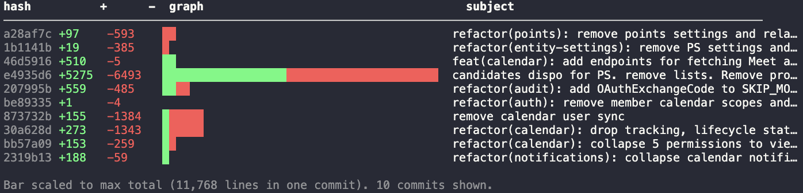

# git-graph

A tiny CLI that prints your recent git commits with a colored `+`/`-` bar graph so you can eyeball the size and shape of each commit at a glance.



Green is insertions, red is deletions, and the bar is scaled to whichever commit in the view had the most total churn.

## Two implementations

This repo ships the same tool twice:

- **`python/`** — a single-file Python script using [PEP 723](https://peps.python.org/pep-0723/) inline metadata. Run with [`uv`](https://docs.astral.sh/uv/). No package, no virtualenv, no install required.
- **`rust/`** — a small Rust crate that compiles to a single static binary.

Pick whichever you prefer. The output is identical.

## Install

### Python (uv)

Requires [`uv`](https://docs.astral.sh/uv/getting-started/installation/).

```bash
curl -fsSL https://raw.githubusercontent.com/rafa-rrayes/git-graph/master/python/git-graph \
  -o ~/.local/bin/git-graph
chmod +x ~/.local/bin/git-graph
```

That's it. The shebang (`#!/usr/bin/env -S uv run --script`) tells the OS to invoke `uv` and run the script with its declared Python version. First run is slightly slow while `uv` provisions a Python; subsequent runs are cached and fast.

### Rust (cargo)

Requires a [Rust toolchain](https://rustup.rs/).

```bash
cargo install --git https://github.com/rafa-rrayes/git-graph git-graph --root ~/.local
```

Or clone and build:

```bash
git clone https://github.com/rafa-rrayes/git-graph
cd git-graph/rust
cargo install --path .
```

### Pre-built binaries

Grab a release binary for macOS or Linux from the [Releases page](https://github.com/rafa-rrayes/git-graph/releases) and drop it on your `PATH`.

## Usage

```bash
git-graph                          # last 10 commits
git-graph -n 3                     # last 3 commits
git graph                          # works too — git auto-discovers `git-*` on PATH as subcommands

git-graph main                     # commits on a specific ref
git-graph v1.0..HEAD               # commits in a revision range
git-graph -- src/                  # scope to a path (or multiple)

git-graph --author rafa            # filter by author (substring match)
git-graph --since "2 weeks ago"    # any git date string
git-graph --until 2025-01-01
git-graph --merges                 # include merge commits (off by default)

git-graph --sort churn             # biggest commits first (default: date)
git-graph --log-scale              # log-scale the bar so small commits stay visible
git-graph --no-color               # plain output (also respects NO_COLOR and non-TTY)
```

Flags compose freely: `git-graph --author rafa --since "1 month ago" --sort churn -- src/`.

The bar auto-scales to terminal width. When colors are off (piped, `NO_COLOR`, or `--no-color`), the bar falls back to `+`/`-` characters so the visual data survives.

## Why two versions?

The Python one is ~80 lines and you can read it top to bottom in a minute. The Rust one is a single static binary with no runtime dependency, ~25× faster startup, and a fun excuse to write a small CLI in Rust. They produce byte-identical output.

## License

MIT — see [LICENSE](LICENSE).
